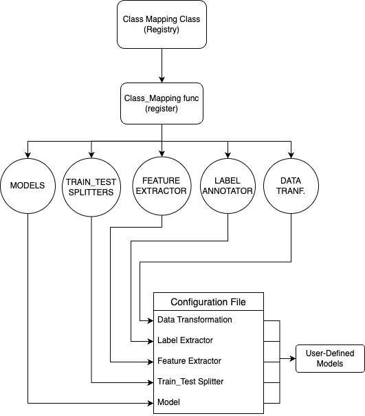
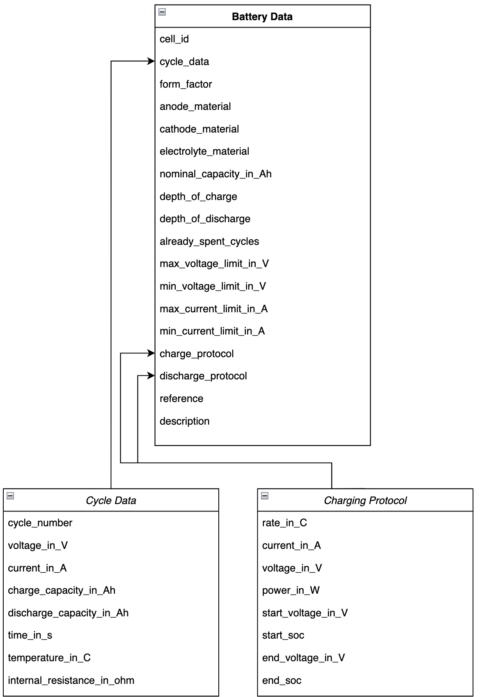
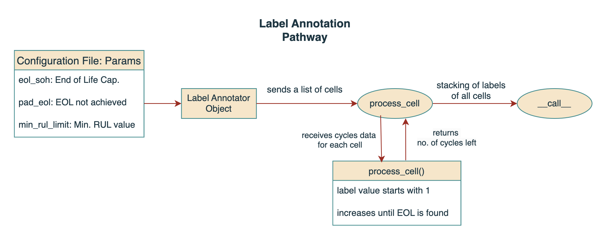
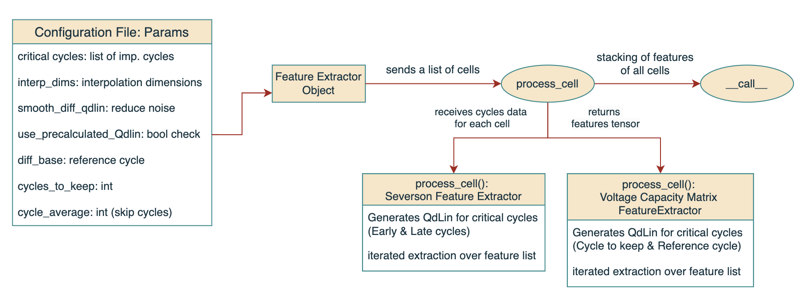
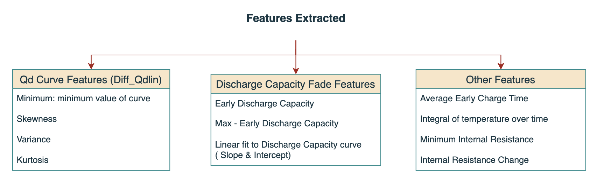

# Bin
`./bin/batteryml.py`

The bin folder separately holds scripts,binaries for managing project lifecycle

## Purpose
It provides tools for downloading datasets, preprocessing raw battery data, and running training and evaluation pipelines.

## Libraries Used
Argparse: To define download, preprocess and run the commands

## Core Functions
### download
    - Uses URLs and filenames from DOWNLOAD_LINKS to fetch datasets.
	- Saves the files in the user-specified directory.
### preprocess
    - Validates input and output paths.
	- Builds a preprocessor object (using PREPROCESSORS) and applies it to the raw input data.
### run:
    - Initializes a Pipeline object using the provided configuration.
	- Handles training and evaluation logic, including checkpoint management, metric evaluation, and model reusability.

## External Dependencies
### batteryml.preprocess
    A utility for downloading datasets
### batteryml.pipeline
    Contains the Pipeline class for orchestrating model training and evaluation
### batteryml.builders
    Provides the PREPROCESSORS factory for creating preprocessor instances based on input type.

## Running the core functions
## Download
`download dataset path\to\save `
## Preprocess
`prerocess input_type --config path\to\input path\to\save -q`
## Run
`run path\to\config --workspace path --device --ckpt-to-resume --train --eval --metric RMSE --seed 0 --epochs 10 --skip-if-executed`

> May check out download.py file for intricate details for downloading files.
---


# Task

## Purpose
1.	Splitting the data into training and testing sets.
2.	Extracting features from the raw data.
3.	Annotating labels for the data.
4.	Applying transformations to features and labels (optional).
5.	Returning the prepared data as a DataBundle object, which contains the features and labels for training and testing.

## Libraries Used
- torch
- tqdm
- builders
- data
- transformation.base.BaseDataTransformation

## Core Functions
1. Attributes
    - train_test_splitter: Defines how the dataset should be split into training and testing data.
	- feature_extractor: Defines how features should be extracted from the raw data.
	- label_annotator: Defines how labels should be annotated.
	- feature_transformation: An optional transformation to apply to the features.
	- label_transformation: An optional transformation to apply to the labels.
2. build
    - Loading Data: It splits the data into training and testing sets using the train_test_splitter, and loads the raw data using BatteryData.load().
	- Feature Extraction: Extracts features for both training and testing data using the provided feature_extractor.
	- Label Annotation: Annotates labels for both training and testing data using the provided label_annotator.
	- Data Masking: Removes rows where the labels are NaN (using boolean masking).
	- Creating DataBundle: A DataBundle is created to store the training and testing features and labels, along with the transformations to be applied.
    **returns**: Databundle object with processed testing and training data 
3. get_raw_data
    -  **returns**: unprocessed (train_cells,test_cells)


## Usage

```
task = Task(train_test_splitter=my_splitter, feature_extractor=my_feature_extractor,label_annotator=my_label_annotator,
feature_transformation=my_feature_transformation, label_transformation=my_label_transformation
)
dataset = task.build()
raw_train_data, raw_test_data = task.get_raw_data()
```
---


# Pipeline
## Purpose
It allows for training, evaluating, and dataset preparation, including saving results and managing checkpoints.
## Libraries Used
-torch: For machine learning operations, model training, and evaluation on PyTorch.
- pickle: For serializing and deserializing Python objects (used for saving and loading models and datasets).
- random: For setting the random seed.
- shutil: For file operations such as copying files.
- hashlib: For creating hash values to uniquely identify dataset configurations.
- numpy: For numerical operations and handling arrays.
- pathlib.Path: For handling filesystem paths in a cross-platform manner.
- datetime: For working with timestamps and formatting dates.
- batteryml.task: Custom library for task-related operations in battery health prediction.
- batteryml.data: For working with datasets, data bundles, and transformations.
- batteryml.builders: For building models, feature extractors, and other components used in the pipeline.
- batteryml.utils: For utility functions, such as importing configurations.
- batteryml.models.base: For defining base models.
## Core functions
1. __init__(self, config_path: Path | str, workspace: Path | str)
- Purpose: Initializes the Pipeline class with a configuration path and workspace.
- Usage: Loads the configuration from the given config_path and sets the workspace.

2. train(self, ...)
- Purpose: Manages the training process of the model.
- Parameters:
	- seed: Random seed for reproducibility.
	- epochs: Number of epochs to train the model (optional).
	- device: The device to run the training on (CPU/GPU).
	- ckpt_to_resume: Path to a checkpoint for resuming training (optional).
	- skip_if_executed: Whether to skip training if the checkpoint already exists.
	- dataset: A pre-loaded dataset (optional).
- Usage: Sets the seed, prepares the dataset, prepares the model, and starts the training process. It also manages checkpoints to avoid redundant training.

3. evaluate(self, ...)
- Purpose: Manages the evaluation process of the trained model.
- Parameters:
	- seed: Random seed for reproducibility.
	- device: The device to run the evaluation on (CPU/GPU).
	- metric: Evaluation metric(s) to use (e.g., RMSE).
	- model: Pre-trained model to evaluate (optional).
	- dataset: Dataset to evaluate the model on (optional).
	- ckpt_to_resume: Path to a checkpoint for loading the model (optional).
	- skip_if_executed: Whether to skip evaluation if the predictions already exist.
- Usage: Sets the seed, prepares the dataset, loads the model, makes predictions, and evaluates the model using the specified metric(s). It saves the predictions and scores to the workspace.

4. _prepare_model(self, ...)
- Purpose: Prepares the model by building it and loading a checkpoint if provided.
- Parameters:
	- ckpt_to_resume: Path to a checkpoint for resuming the model (optional).
	- device: The device to run the model on (CPU/GPU).
- Usage: Builds the model using the configuration and loads a checkpoint if specified. The model is then moved to the specified device (CPU or GPU).

5. load_config(config_path: str, workspace: str | None, config_fields: list | None)
- Purpose: Loads the configuration from a YAML or JSON file and sets the workspace.
- Parameters:
	- config_path: Path to the configuration file.
	- workspace: Path to the workspace where the results will be stored.      
	- config_fields: List of configuration fields to load (optional).
- Usage: Reads the configuration file and prepares the workspace. It ensures that the workspace exists or creates it if necessary.

6. build_dataset(configs: dict, device: str, config_fields: list | None)
- Purpose: Builds the dataset from the configuration and caches it for future use.
- Parameters:
	- configs: The configuration dictionary.
	- device: The device to move the dataset to (CPU/GPU).
	- config_fields: Configuration fields for building the dataset (optional).
- Usage: Builds the dataset using the Task class and caches it to avoid reloading it repeatedly. If the dataset exists in the cache, it loads it from there.

7. set_seed(seed: int)
- Purpose: Sets the random seed for reproducibility.
- Parameters:
	- seed: The random seed value.
- Usage: Ensures that the results are reproducible by setting the seed for Python’s random module, NumPy, and PyTorch.

8. recursive_dump_string(data)
- Purpose: Converts nested data structures (lists, dictionaries) into a string representation for hashing.
- Parameters:
	- data: The data to convert.
- Usage: Recursively converts lists and dictionaries into strings that can be hashed for caching purposes.

9. hash_string(string)
- Purpose: Hashes a string using SHA-256.
- Parameters:
	- string: The string to hash.
- Usage: Generates a unique hash for a given string (used for dataset caching).

10. timestamp(marker: bool = False)
- Purpose: Generates a timestamp.
- Parameters:
	- marker: Whether to format the timestamp as a marker (optional).
- Usage: Returns the current timestamp as a string in the specified format.
## Usage
```
pipeline = Pipeline(config_path='config.yaml', workspace='workspace/')

model, dataset = pipeline.train(seed=42, epochs=10)

pipeline.evaluate(seed=42, model=model, metric='RMSE')
```
---
# Dynamic Registry Model



## Purpose
1. **Dynamic Class Registration:** Classes are registered with a unique name in a Registry instance, enabling dynamic lookups and instantiation of these classes
2. **Extensibility**
New components (e.g., models, preprocessors) can be added without altering the core code.

## Components
1.	Registry:
	- Acts as the central manager for registering and building instances.
	- Holds mappings of names to classes.
2.	Classes (e.g., MyModel):
	- Registered to the registry using @register.
	- Instantiated dynamically through the build method.
3.	Configuration:
	- A dictionary specifying the class name and parameters required for instantiation.
	- Serves as input to the build method.
## Workflow
1. 	Registration:
	- A class is registered using the @register decorator.
	```
	@MODELS.register()
	class MyModel:
		def __init__(self, data):
			self.data = data
	```
2. Building an Instance:
	- A configuration dictionary is used to create an instance of the registered class.
	```
	config = dict(name='MyModel', data='foo')
	mymodel = MODELS.build(config)
	```
---

# BatteryData

## Purpose 
It includes classes to represent:
 - Individual battery cycles.
 - Charging and discharging protocols.
 - Comprehensive battery data.
It provides a framework for managing, processing, and analyzing battery data, specifically for tracking the properties, cycling behavior, and protocols of battery cells.

## Components
- Classes
	1.	CycleData
	- Represents the data of a single battery cycle.
	- Attributes include voltage, current, charge/discharge capacity, time, temperature, and internal resistance.
	2.	CyclingProtocol
	- Represents the protocol for charging or discharging a battery.
	- Attributes include rate, current, voltage, power, and state of charge (SOC) limits.
	3.	BatteryData
	- Represents the overall data for a battery cell, including Cell ID and material properties (anode, cathode, electrolyte),Charge and discharge protocols (as CyclingProtocol instances)
- Methods
	1.	Serialization
	-	BatteryData.dump(path) writes battery data to a file.
	-	BatteryData.load(path) reads battery data from a file and reconstructs the object.
	2.	Data Conversion
	-	to_dict methods in each class convert objects into dictionaries for easy serialization or processing.


## Workflow
BatteryData Aggregates CycleData and CyclingProtocol:
- A BatteryData object contains a list of CycleData instances representing each cycle of the battery.
- It also contains lists of CyclingProtocol instances for charge and discharge protocols.

## Usage

### Create cycle data
```
cycle1 = CycleData(
    cycle_number=1,
    voltage_in_V=[3.7, 3.8, 3.9],
    current_in_A=[0.5, 0.4, 0.3],
    charge_capacity_in_Ah=[0.1, 0.2, 0.3]
)
```
### Create charge protocol
```
charge_protocol = CyclingProtocol(
    rate_in_C=1.0,
    current_in_A=0.5,
    start_voltage_in_V=3.6,
    end_voltage_in_V=4.2
)
```
### Create battery data
```
battery = BatteryData(
    cell_id="Battery123",
    cycle_data=[cycle1],
    form_factor="18650",
    anode_material="Graphite",
    cathode_material="NMC",
    charge_protocol=[charge_protocol]
)
```
---
# Preprocessors

## Purpose
The goal is to:
- Extract, clean, and organize battery data from .zip files containing raw .txt or .xlsx/.xls files.
- Filter noisy data and retain only valid battery cycles.
- Save the processed data in a reusable format (e.g., .pkl files) for downstream analysis, such as performance evaluation or machine learning tasks.

## Core Functions
1. Data Extraction and Loading
- Inflate .zip files to extract raw data files.
- Load raw data from .txt or .xlsx/.xls files using helper functions (load_txt and load_excel).
2. Data Cleaning and Organization
- Sort data by date and Test_Time(s) for consistency.
- Organize cycle indices to ensure proper sequencing of charge/discharge cycles.
3. Feature Computation
- Compute charge (Qc) and discharge (Qd) capacities for each cycle using current and time data.
4. Output and Caching
- Package processed data into BatteryData objects, including metadata (e.g., nominal capacity, material types).
- Save processed data as .pkl files for future use.
5. Cleanup
- Remove temporary files (e.g., extracted directories) to manage storage efficiently.

## Components
1. Core Classes
	- Inherits from BasePreprocessor.
	- Implements the process method to handle the complete data processing pipeline.

2. Helper Functions
	1. calc_Q:
		- Computes cumulative charge or discharge capacity based on current and time data.
	2. organize_cycle_index:
		- Adjusts cycle indices to ensure proper sequencing across cycles.
	3. extract_date_from_filename:
		- Extracts date information from filenames using regular expressions.
	4. load_txt:
		- Loads raw data from .txt files into a structured DataFrame.
	5. load_excel:
		- Loads raw data from .xlsx/.xls files, caching the result for faster reloading.

3. Data Structures
	- CycleData:
		- Represents data for a single battery cycle, including voltage, current, time, and charge/discharge capacities.
	- BatteryData:
		- Represents processed battery data, including metadata (e.g., materials, nominal capacity) and cleaned cycle data.

4. External Libraries
	- pandas: For handling tabular data.
	- numpy: For numerical computations.
	- scipy.signal.medfilt: For median filtering noisy data.
	- tqdm: For progress tracking.
	- zipfile and shutil: For file extraction and cleanup.
	- numba.njit: For accelerating computational functions (calc_Q, organize_cycle_index).

## Usage
Run Preprocessing
```
preprocessor = CALCEPreprocessor(silent=False)
processed, skipped = preprocessor.process('/data/CALCE/')
print(f'Processed: {processed}, Skipped: {skipped}')
```

Analyze Processed Data:

```
with open('CALCE_CX2_8.pkl', 'rb') as f:
    battery_data = pickle.load(f)
print(battery_data.cycle_data[0])  # Access the first cycle's data
```
---
# Annotators
## Label
### Purpose
1. Process battery data (represented as BatteryData objects) to generate labels.
2.	Use these labels for tasks like regression or classification in machine learning models.

### Components

1. BaseLabelAnnotator (Abstract Base Class)
- Core Methods
	- 	\__call__()
		- Allows the annotator instance to be used like a function.
		- Processes a list of BatteryData objects (cells) and returns a torch.Tensor of labels.
	```
	def __call__(self, cells: List[BatteryData]):
    return torch.stack([
        self.process_cell(cell) for cell in cells]).float().view(-1)
	```
	- process_cell()
		- Processes a single BatteryData object to generate its label.
2. RULLabelAnnotator (Concrete Implementation)
`def process_cell(self, cell_data: BatteryData) -> torch.Tensor:`
### Workflow
1.	Prepare Battery Data:
	- Load battery data into BatteryData objects containing cycle data, nominal capacity, and other attributes.
2.	Initialize Annotator:
	- Create an instance of RULLabelAnnotator with desired parameters.
3.	Generate Labels:
	- Pass the list of BatteryData objects to the annotator instance (using \__call__).
	- Retrieve the resulting tensor of labels.
```
annotator = RULLabelAnnotator(eol_soh=0.8, pad_eol=True, min_rul_limit=100.0)
battery_data = [...]  # List of BatteryData objects
labels = annotator(battery_data)  # Returns a tensor of RUL labels
```

## Feature
### Purpose
A feature extractor is designed to transform raw data into a meaningful set of features that can be used by machine learning models

### Components

1. Input Data
	-Raw Battery Data: Includes parameters like current (I), voltage (V), discharge capacity (Q), and temperature over cycles.
	- Cycle Data: Contains cycle-specific performance metrics.

2. Preprocessing Functions
	- interpolate: Smooths or interpolates data to fill gaps and standardize the input.
	- smooth: Removes noise or outliers to ensure cleaner features.
	- get_Qdlin: Calculates the normalized discharge capacity as a function of voltage for each cycle.

3. Feature Computation
	- Extracts statistical features (e.g., variance, skewness) or derived metrics (e.g., capacity fade slope, internal resistance).
	- Includes domain-specific transformations like Qdlin and differences between early and late cycles.

4. Configuration Parameters
	- Critical Cycles: Determines which cycles to analyze (e.g., first, middle, last).
	- Smoothing Options: Toggles smoothing for data like Qdlin.
	- Cycle Averaging: Downsamples the feature set by averaging over cycles.

5. Output
	- Feature Tensor: A structured set of numerical features ready for model training.
### What is QdLin?
#### QdLin: Discharge Capacity Normalization

**QdLin** refers to a normalized discharge capacity curve obtained by interpolating the relationship between voltage and discharge capacity during the discharge phase of a battery cycle.

#### **Purpose**
- To create a uniform representation of discharge capacity across all cycles, allowing for easy comparison and analysis.
- Helps identify differences in degradation trends between cycles.


#### **Key Components**
1. **Current (I):** Measures the flow of electric charge during the cycle.
2. **Voltage (V):** Voltage measurements during the battery's discharge phase.
3. **Discharge Capacity (Q):** Cumulative capacity delivered during discharge, typically in ampere-hours (Ah).
4. **Interpolation:** Converts the unevenly distributed data into a uniform format.


#### **Calculation Process**
1. **Data Filtering:**  
   - Select only the data points where the current `I` is below a threshold (e.g., `I < -eps`) to focus on the discharge phase.

2. **Interpolation:**  
   - Use the `interp1d` function to interpolate the discharge capacity (`Q`) as a function of voltage (`V`).
   - Create a uniform grid of voltage values between `min_V` and `max_V` (e.g., 1000 points).

3. **Normalization:**  
   - Reverse the interpolated discharge capacity curve to ensure alignment with degradation analysis.


#### **Mathematical Representation**
Given:
- \( I \): Current in amps
- \( V \): Voltage in volts
- \( Q \): Discharge capacity in Ah
- \( V_{\text{min}}, V_{\text{max}} \): Voltage limits

**Formula:**
\[ Q_{\text{dLin}}(V) = \text{interpolate}(V[I < -\epsilon], Q[I < -\epsilon], \text{grid between } V_{\text{min}} \text{ and } V_{\text{max}}) \]


#### **Example**
1. Voltage: \( V = [3.0, 3.2, 3.5, 3.8, 4.0] \)
2. Discharge Capacity: \( Q = [0.1, 0.2, 0.4, 0.6, 0.8] \)
3. Interpolated Voltage Grid: \( V_{\text{grid}} = [3.0, 3.1, 3.2, \ldots, 4.0] \)
4. Output: \( Q_{\text{dLin}}(V_{\text{grid}}) \) gives interpolated capacity at uniform voltage intervals.


### Features Extracted

The table above represents the features extracted using the cycle data for a single cell.

### Difference Between Severson & Voltage_Capacity_Matrix Feature Extractors
| **Aspect**                  | **Severson Feature Extractor**                                          | **Voltage Capacity Matrix (VCM) Feature Extractor**                   |
|-----------------------------|-------------------------------------------------------------------------|------------------------------------------------------------------------|
| **Purpose**                 | Extract statistical features based on battery degradation trends.      | Extract features based on differences in voltage-capacity profiles.   |
| **Key Input Data**          | Battery cycle data, including capacity, voltage, and current.          | Voltage-capacity data for multiple cycles.                            |
| **Base Calculation**        | Relies on statistical properties (e.g., variance, slope) of capacity.  | Uses `diff_base_qdlin` derived from a reference cycle.                |
| **Core Feature**            | Linear capacity fade and early-to-late cycle differences.              | Voltage-capacity matrix differences between cycles.                   |
| **Critical Cycles**         | Typically uses early, middle, and late cycles for feature extraction.  | Compares each cycle against a specific reference cycle (`diff_base`). |
| **Data Preprocessing**      | Interpolates and smooths capacity data over cycles.                    | Interpolates, smooths, and averages `Qdlin` over selected cycles.     |
| **Features Extracted**      | Variance, skewness, and capacity fade slope.                           | Differences in normalized capacity (`Qdlin`) over cycles.             |
| **Output Format**           | A tensor of statistical features for selected cycles.                 | A tensor of voltage-capacity differences for each cycle.              |
| **Key Advantage**           | Captures high-level trends and degradation behaviors.                  | Captures cycle-specific differences for finer-grained analysis.       |
| **Use Case**                | Predicting RUL and capacity fade trends.                               | Understanding degradation patterns and cell-to-cell variations.       |